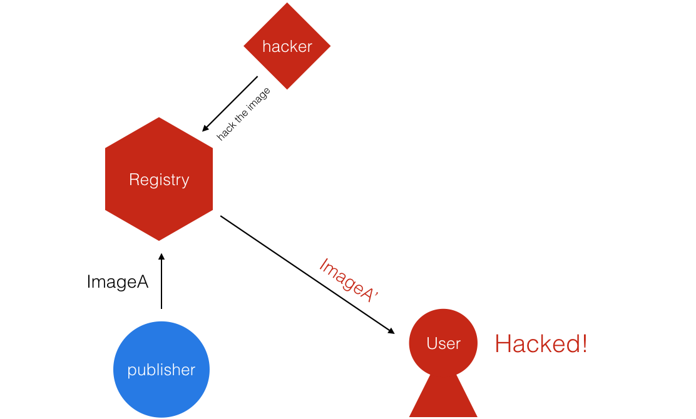
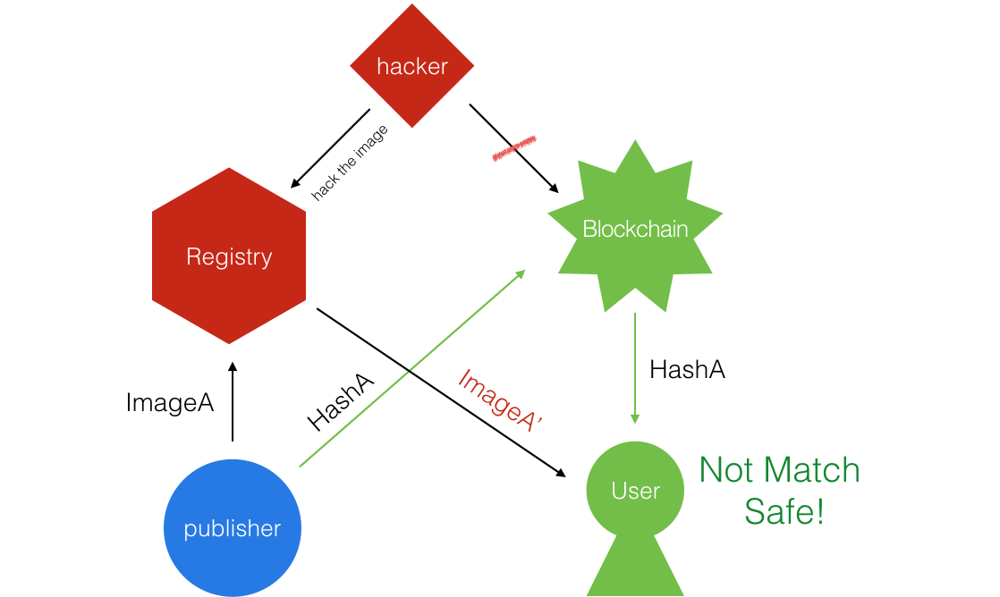

# DaoChain

[](https://dashboard.daocloud.io/orgs/daocloud/build-flows/b63b9fb5-d3d4-404b-8699-548910d87e51)
[](https://dashboard.daocloud.io/orgs/daocloud/build-flows/b63b9fb5-d3d4-404b-8699-548910d87e51)
[](https://dashboard.daocloud.io/orgs/daocloud/build-flows/b63b9fb5-d3d4-404b-8699-548910d87e51)

DaoChain 是一个基于以太坊的去中心化应用（DApp），致力于解决互联网环境下数字资产（包括Docker image）分享、交易时的信任问题。


## Why

开放的互联网使我们可以很方便自由的在网络上分享数据，但也正因为它的开放性，我们很难确定获取到的数据在传输过程中是否被恶意篡改。RSA 和 PGP 的诞生使网络上一对一的传输的可信度和安全性能得到保障。发展到云时代，很多数据都采用存储在公有云上中转的方式进行传播，如何方便的发布数据和方便的校验获取到的数据就成为了一个难题。

Docker 镜像的分发就是典型的经过中转的数据分享方式，发布者在本地构建好镜像然后将镜像 push 到镜像仓库，消费者从镜像仓库 pull 下镜像来使用。如何确保拉取的镜像的确就是该发布者发布的？如何确保镜像没有被托管商或者在传输过程中被修改？如何标记我对镜像的所有权？

**托管仓库的镜像被黑客篡改：**


我们为此开发了 DaoChain，将镜像的验证信息存储在去中心化的区块链网络上，杜绝了中心化的网络中数据被轻易篡改的可能。离线签名离线验证让发布和获取过程都变得更加方便、安全。

## How

**接入区块链验证让黑客无计可施：**

镜像发布者在本地将制作出的镜像计算 hash 后将信息写入区块链。区块链本身的密码学机制保证了写入过程无法伪造，然后就可以将镜像发布到公有云上进行分享了。

镜像使用者从公有云拉取镜像到本地后对镜像文件计算出 hash，使用从账号注册商获取到的以太坊账号地址和镜像 URL，调用智能合约从映射中查询到记录的镜像详情和算出的 hash 进行匹配，就可以确定镜像是否是由该作者发布的了。

### 项目结构

在众多的区块链实现中我们选择了以太坊来作为 DaoChain 的基础。[以太坊（Ethereum）](https://www.ethereum.org/)是一个有智能合约功能的公共区块链平台，提供去中心化的虚拟机来处理点对点合约。

DaoChain 项目包含四个部分：[智能合约](https://github.com/DaoCloud/dao-chain/tree/master/contract)，[以太坊客户端](https://github.com/DaoCloud/dao-chain/tree/master/geth)，[本地服务器和验证客户端](https://github.com/DaoCloud/dao-chain/tree/master/app)，[WebUI](https://github.com/Revolution1/dao-chain/tree/master/webui)

**项目结构图:**


### 智能合约

Daochain 的智能合约项目使用 [solidity](https://github.com/ethereum/solidity) 语言来编写，使用 [truffle](https://github.com/ConsenSys/truffle)

[contract/contracts](https://github.com/DaoCloud/dao-chain/tree/master/contract/contracts) 目录下有两个智能合约（Migrations.sol 是部署合约用）当前版本用到的是 [DaoHubVerify.sol](https://github.com/DaoCloud/dao-chain/blob/master/contract/contracts/DaoHubVerify.sol)。合约中定义了一个数据结构：

```solidity
mapping(address => mapping(bytes => Image)) ownerIdImageMap;
```

这个嵌套的 mapping 能够存储 address（作者以太坊账户地址），repoTag（镜像url），和镜像详情（包括 hash，imageID 等）的对应关系。
 
**验证流程:**


另外一个智能合约 [DaoHubAccount.sol](https://github.com/DaoCloud/dao-chain/blob/master/contract/contracts/DaoHubAccount.sol) 提供了映射以太坊账号和镜像托管商账号的功能。DaoChain 将会在后续版本支持这一合约，实现真正的完全去中心化，离线的镜像验证。

### 以太坊客户端

DaoChain 项目使用的是官方以太坊客户端 [go-ethereum](https://github.com/ethereum/go-ethereum)。

使用 [eth-net-intelligence-api](https://github.com/cubedro/eth-net-intelligence-api) 来做 metrics 收集。

### 本地服务器和命令行工具

本地服务器和验证客户端采用的是 Python 语言。
包含两部分：

* 本地服务器：运行在本地容器中的服务器，通过 Docker API 与 Docker 沟通，通过 JSONRPC 与以太坊客户端沟通，并提供 RestAPI 给 WebUI 和 命令行工具使用。
* 命令行工具：提供查看和使用 DaoChain 功能的命令行工具（开发中...）。

这里主要实现了计算镜像 Hash 的[算法](https://github.com/Revolution1/dao-chain/blob/master/app/dockerclient.py#L35)。
Docker 镜像在 push 到 Registry 的会生成一个 hash，但这个值并不会随镜像内容的变化而变换。我们对 Docker save 出来的镜像 tar 文件内容计算出一个 sha256 值，唯一的对应该镜像。
> 注：目前实现的计算方式在效率上比较低下，后续我们会进行优化。

### WebUI

DaoChain 的 WebUI 采用的是 AngularJS 框架，并配合 DaoCloud 的前端组件库 DaoStyle。


## Goals

- [x] 镜像信任验证
- [ ] 作为任意 registry 的公有认证链
- [ ] 实现镜像资产交易功能
- [ ] 实现 registry 去中心化


## QuickStart

1. 克隆项目代码并使用 docker-compose 启动服务

    ```
    git clone https://github.com/DaoCloud/dao-chain.git
    cd dao-chain
    docker-compose up -d
    ```

2. 打开 WebUI (http://127.0.0.1:8000)

## Tutorial

### 获取安全签名的镜像

* 请您登陆 DaoCloud 账号
* 点击账户详情选择您的组织，并填写密码生成钱包地址（请务必保证密码的安全！）
* 选择“账户信息”，打开挖矿开关，系统会在后台启动以太坊客户端，开始同步所有验证数据，同步完成后会进行挖矿，过一段时间会获取账户余额
* 点击“镜像市场”，可以看到拥有区块链验证的公开镜像，点击拉取并在“本地镜像”查看，若通过验证则证明本地镜像与发布者提交的一致

### 发布镜像并签名

* 选择“云端镜像”，这里是您保存在 DaoCloud 上的镜像。
* 拉取您需要签名的镜像。
* 点击签名，后台会计算校验码并以您当前使用的区块链钱包地址发布签名，系统会等待区块被确认所以会等待一段时间
* 完成后签名后登录 DaoCloud 选择公开镜像，可以在 DaoChain “镜像市场” 看到

申请测试币或咨询请联系 support@daocloud.io

## TODO

* 完善测试和文档
* 完成命令行工具
* 优化镜像哈希算法
* 支持节点自动发现功能
* 实现完全去中心化离线验证


## Contribution

请参考 [CONTRIBUTION.md](./CONTRIBUTION.md)

## Licensing

[Apache 2](./LICENSE)
