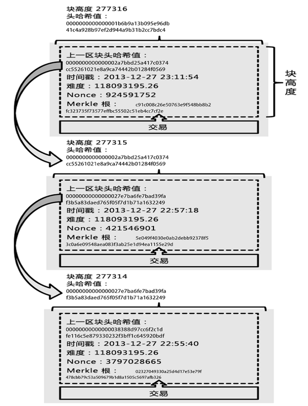

当 Docker 遇到区块链
==================

这是一个文艺范十足(恶俗)的标题，试图撮合两个八杆子打不着的家伙。故事的结局一般都是按照套路出牌，两个主角愉快地在一起了。结局总是类似的，不过过程却有各自的精彩。

区块链刨底
--------

区块链（Blockchain）技术自身仍然在飞速发展中，目前还缺乏统一的规范和标准，试图给区块链下定义都是一个难题。根据 [wikipedia](https://en.wikipedia.org/wiki/Blockchain_\(database\)) 的定义

```
Blockchain is a distributed database that maintains a continuously-growing list of records called blocks.
```

越来越多的研究者、专家把区块链归类为分布式数据库的范畴，也有人把区块链定义为一种类似于链表的数据结构：



```
区块链是一个类似于链表的数据结构，该数据结构中每一个节点记录了前节点中数据的 Hash 值、当前节点的数据。
在当前节点不变都情况下，前节点的任何改变都会使得这条链无效(invalid)。
```

笔者认为两种定义是不冲突的、可以说是相辅相成的。前者更多的强调区块链的分布式协作的集体行为，后者更多的关注这一协作群体中每一个个体——区块链本身。在大多数语境下，大家关注更多的是区块链分布式协作的集体效应，因此下文关于区块链，不特意说明的情况下，都与 wikipedia 的分布式数据库定义一致，关于区块链数据结构，推荐大家看一下一本详细讲解 bitcoin 技术书籍 [Mastering Bitcoin](http://uplib.fr/w/images/8/83/Mastering_Bitcoin-Antonopoulos.pdf)，你将看到，Bitcoin 的成功，不仅仅只有区块链的功劳，Game design 和密码学都是极其重要的部分！

提到那些号称颠覆银河系的新科技、新技术，就不得不提 Gartner 技术成熟度曲线(The Gartner hyper cycle)。区块链号称颠覆整个金融行业的既有规则、既有模式，Gartner 2016 技术成熟度曲线中，我们可以在过高期望的峰值（Peak of Inflated Expectations）附近找到区块链，所以，各位同学冷静再冷静。并且 Gartner 也在分析 2016 成熟度曲线中提到 [Bitcoin is the only proven blockchain](http://www.gartner.com/smarterwithgartner/3-trends-appear-in-the-gartner-hype-cycle-for-emerging-technologies-2016/)，注意这里的区块链指的是 wikipedia 版的定义。接下来笔者信口胡来，跟大家一起分析一下为什么 Bitcoin is the only proven blockchain。


Why Bitcoin is the only proven blockchain
-----------------------------------------

前面我们已经定义过，区块链是一个分布式数据库，维护持续增长的记录链表——被称为 blocks 的东西(神啊，原谅笔者蹩脚的汉语吧)，既然是分布式数据库，那么接下来这块由分布式数据库专家来写。

提到分布式数据库，肯定离不开 [CAP 理论](https://en.wikipedia.org/wiki/CAP_theorem)，CAP 是一个很有意思的理论，在分布式系统中有着霸主一样的地位。

CAP 理论：一个分布式系统最多只能同时满足一致性（Consistency）、可用性（Availability）和分区容忍性（Partition tolerance）这三项中的两项。

这三项看起来都是很好的东西，怎么不能同时满足呢？宝宝不开心，一定是架构师技术不好，没有找到更好的方式。但是，有一个坏人还给证明了，CAP 是正确的！

* 一致性 `All nodes see the same data at the same time`
* 可用性 `Reads and writes always succeed`
* 分区容忍性 `The system continues to operate despite arbitrary message loss or failure of part of the system`

我们根据 Blockchain 的工作方式(Bitcoin 中矿工网络所维护的 blockchain 的工作方式)，每个矿工节点独立的工作(不考虑矿池，会加入无谓的复杂度)，接收 Bitcoin 用户的转账请求，竞争寻找新的满足要求的 Hash 值，将这些交易打包到新的 block 并广播出去(Gossip 算法)，或者接收并验证收到的广播数据，在同一刻，各个矿工的数据并不是严格一致的（有些接收到了一个广播，有些还没有，有些接收到了另一个广播），但是每个用户的读写请求都是会成功的，只是有可能读到的数据并不是最新的，也可能不是最终的，因此这是一个满足最终一致性的 `AP` 的系统。

区块链(最起码 Bitcoin 用到的区块链)是一个完全副本的(每个矿工节点都维护一份完全都数据)、W=1, R=1 的单读单写的(客户端写成功一个矿工就算成功了，读一个矿工的数据就返回)、满足最终一致性的分布式数据库。完全副本带来的去中心化的好处，但这是一剂很猛的药，理论上讲区块链所维护的数据量不能超过矿工参与者中磁盘容量最小值，否则这个矿工将要面临被退出的处境。另外受限于单个矿工的计算能力、全网的广播扩散速度，Bitcoin 限制了每 10min 一个 Block，每个 Block 1MB 的上限，使的 Bitcoin 网络的交易频率相对于 Visa、银联等低得多的多。

但是比特币依然是唯一被证实的区块链，那什么是`证实的区块链`呢？笔者网上找了好久也找不到答案，只好再信口胡来一次了，区块链是一个完全副本的对不对？要全网广播的对不对？代价很高对不对？性能不会很好对不对？那么只是把区块链用作分布式数据库的是不是有点套概念了？

被证实的区块链(项目)指的是：

```
如果不能将这个项目中的区块链替换为分布式共享数据库，这个项目才是被证实的区块链
```

如果 Bitcoin 将区块链换成分布式共享数据库(变得易受攻击、篡改历史难度大大降低等)，Bitcoin 就不是目前大家看到的 Bitcoin，所以 Bitcoin 是被证实的区块链。

被证实的区块链的定义提醒了各位，在区块链的基础上设计合理的游戏规则、奖励规则，将区块链用成区块链，而不是把区块链仅仅用成了一个分布式共享数据库，这才是真正意义的区块链。

可惜的是，目前这样的项目真不多，笔者抱一下 Gartner 的大腿，站在 Gartner 战队：

```
Bitcoin is the only proven blockchain
```

Docker 镜像及分享
---------------

Blockchain 独角戏上演太久，大家应该迫不及待想要看到第二位主角出场了吧？

Docker 镜像(images)留学归来，操着一口浓重的伦敦音：

An image is an inert, immutable, file that's essentially a snapshot of a container. Images are created with the build command, and they'll produce a container when started with `docker run`. Images are stored in a Docker registry such as `hub.docker.com`. Because they can become quite large, images are designed to be composed of layers of other images, allowing a miminal amount of data to be sent when transferring images over the network.

本地的镜像可以通过 `docker images` 命令来查看，比如：

```shell
$> docker images
REPOSITORY                             TAG                 IMAGE ID            CREATED             SIZE
daocloud.io/daocloud/cockroach         v0.4                9845d5c4db1d        2 weeks ago         206.1 MB
daocloud.io/daocloud/spark-cluster     v0.6                9862ddb186a4        4 weeks ago         738.3 MB
daocloud.io/daocloud/dce-agent         2.0.3               3edfca3bd5aa        5 weeks ago         227.8 MB
daocloud.io/daocloud/dce               2.0.3               08a9b59123b5        5 weeks ago         27.08 MB
daocloud.io/daocloud/dce-controller    2.0.3               3bde2c3b0204        5 weeks ago         401 MB
daocloud.io/daocloud/sparrow           v0.1                f4040ff887c8        7 weeks ago         599.2 MB
daocloud.io/daocloud/dce-compose       2.0.3               e32a31fda169        8 weeks ago         21.08 MB
daocloud.io/daocloud/dce-swarm         2.0.3               55c1954cdfb4        8 weeks ago         19.49 MB
centos                                 6.8                 0cd976dc0a98        11 weeks ago        194.5 MB
daocloud.io/daocloud/hadoop-cluster    v0.5                db929fad9145        12 weeks ago        858.1 MB
daocloud.io/daocloud/zookeeper         v0.4                72d5965155da        3 months ago        567.2 MB
daocloud.io/daocloud/dce-etcd          2.0.3               e81032a59e55        5 months ago        32.29 MB
```

镜像存在镜像仓库里，通过 `docker pull` 的命令把它从仓库下载下来并通过 `docker run` 的方式启动容器。镜像开发者通过 `docker build` 命令把写好的 `Dockerfile` 以及一些二进制文件打包成镜像，然后 `docker push` 把镜像上传到镜像仓库，镜像可谓是容器技术的内容市场，心细的小伙伴可能已经发现 Docker 的布局 https://store.docker.com/ 俨然 Docker 在向乔帮主致敬啊。

镜像仓库的存在有点类似 git repository，极大的方便了镜像之间的共享。但是，前段时间看到一个新闻，说是一家金融公司把文本数据放在公有云上，不可见部分被篡改了(最看不懂的就是篡改不可见部分)！！！公有云厂商不愿意背这个锅，有些人就咆哮，私下看人家数据太不好了，小白客户可能不知道什么是 `sha256`, `md5`, 不知道什么是加密，可是金融行业从业人员，难道不知道加密防他人读、校验防篡改吗？发散来讲，放在镜像仓库的镜像也有被篡改的可能啊！让每个用户上传镜像时存 hash 校验？然后还要对镜像加密、`docker pull` 下来的镜像还要先解密才可用？

这也未必有点难为用户了，从业有先后、术业有专攻，DaoCloud 认为，公有云客户就应该能安心做应用，剩下的我们来帮你搞定！我们试图构建第二个能被证实的 Blockchain。

Daochain
--------

假设这样一种场景，仓库提供者与贵公司大哥八字不合，或者 Docker 公司有个家伙年终奖发少了？你的镜像是安全的吗？

```
> 刚才都锦囊我都知道，我自己存 hash 值
> 小红花戴起来，的确比小白上升了一个数量级的觉悟，但是你都同事想用你都镜像呢？
> 把 hash 值邮件给他，他自己下载镜像自己校验。
> 但是有一天老板给你好几天假期，你可以度假了，你还能(愿意)及时地处理邮件吗，或者说你在帮一个美女实习生调 bug。
> 公司内部共享一个共享数据库就好了嘛
> 但是每次上传或者更新镜像，你都会记得及时更新数据库吗？另外，企业间的共享怎么做？比如隔壁家一个叫 google 的公司做的镜像挺好用的。
> 怎么那么多但是，你说怎么办？
```

正式一点，目前的公共镜像仓库是建立在开发者对仓库维护者的信任的基础上的，开发者相信共有仓库的维护者不会改变他们的镜像，但是在一些极端的情况下这个假设是不存在的，比如商业竞争、黑客攻击、内部员工故意使坏等等。另一方面，为了做到安全，现行技术可能会对镜像用户提出过高的要求，并且对容器原生技术有很强的侵入性(存 hash 值，校验等)。

用户有分享(有偿或者无偿)的需求，这正是 https://store.docker.com/ 正在布局的，有保证数据不被篡改的强烈的安全需求。一句话：

**安全无小事!**

因此，Daocloud 在镜像反病毒，漏洞检查之后隆重推出了分布式镜像校验机制——Daochain，基于高端霸气上档次的区块链技术。

简单来讲，用户 A 在使用 Daochain 上传镜像到公有仓库的同时，会将 hash 值上传到区块链上，DaoCloud 与众多区块链的维护者共同维护这条区块链（移除了开发者对集中化管理者的信任假设），保证任何人对区块链对非法篡改都不会得逞，正常的数据读写得到满足。用户 B 凭借对用户 A 的信任(比如声望很好的大公司，比如阿里、Google 或者公司同事)从共有仓库获取 Docker 镜像，同时从区块链中读取该镜像的 hash 值，并在本地进行验证。

Daochain 使用[以太坊](https://www.ethereum.org/) 作为 Blockchain 的实现，以太坊号称是第二代区块链(相对 Bitcoin 作为第一代区块链)，具有图灵完备的特征，是一个有智能合约功能的公共区块链平台，通过过密货币以太币的润滑作用，提供去中心化的虚拟机来处理点对点合约。注意 Daochain 只是用到了以太坊的实现，并没有使用它的公共区块链，而是自己私搭乱建了另一个专属的区块链，我们欢迎各位矿工加入我们的挖矿队伍，具体方式参见[内测及奖励](#内测及奖励)。

-一个典型的智能合约长这个样子：

```
contract mortal {
    /* Define variable owner of the type address*/
    address owner;

    /* this function is executed at initialization and sets the owner of the contract */
    function mortal() { owner = msg.sender; }

    /* Function to recover the funds on the contract */
    function kill() { if (msg.sender == owner) selfdestruct(owner); }
}

contract greeter is mortal {
    /* define variable greeting of the type string */
    string greeting;

    /* this runs when the contract is executed */
    function greeter(string _greeting) public {
        greeting = _greeting;

     }

    /* main function */
    function greet() constant returns (string) {
        return greeting;
     }
 }
```

更多更详细关于智能合约的知识，可以参阅以太坊的 [Hello world sample](https://www.ethereum.org/greeter)。

讲到这里，聪明的你应该猜出来我们怎么做的了。我们是不是 the second proven blockchain 呢？欢迎大家来讨论！

我们 DaoChain 的源码开放在 [DaoChain on Github](https://github.com/DaoCloud/dao-chain)，透露一下，DaoChain 的核心合约也在这里哦。后续我们会完善客户端功能、添加更多测试和文档。同时也欢迎大家来提 Issue 和 Pull request。

内测及奖励
--------

DaoChain 第一版测试版现在向 Daocloud 用户开放测试，对区块链技术和镜像安全感兴趣的小伙伴们可以加入我们近距离感受“神秘”的区块链。

### 开始探索 DaoChain

克隆下 DaoChain 的源码后我们可以使用其中的 docker-compose.yml 来启动本地的区块链节点，访问本地 web 客户端。

```
git clone https://github.com/DaoCloud/dao-chain
cd dao-chain && docker-compose up -d
```
打开你的浏览器，访问 [http://localhost:8000](http://localhost:8000) 就可以看到 Web 客户端了。

第一次使用需要登录 daocloud 账号并切换到账户详情界面创建你的区块链钱包，选择你要绑定的 daohub 组织，填入你的账户加密密码就可以创建并绑定钱包地址到 DaoHub 组织了。
> 注：这里填入的密码是用来加密区块链账户的私钥的，不是你的 DaoCloud 密码哟。

客户端有四个页面：

**云端镜像**：在这里我们可以看到当前组织下拥有的镜像和镜像的验证情况，并且可以拉取镜像到本地。

**本地镜像**：在这里我们可以看到本地拥有的镜像和他们的验证情况，第一次进入的时候会一次性验证所有的镜像。目前版本可能会验证时间较长，请大家耐心等待。

我们可以在这个页面对属于自己组织下的镜像进行签名，点击签名输入前面的钱包密码，客户端就会开始计算镜像的 hash 并写入区块链了（需要当前钱包有余额），可以实时看到写入情况。更新镜像导致验证失败的也可以进行重新签名。

**镜像市场**： 在这里可以看到 DaoHub 上所有开放的已经通过验证的镜像，大家可以自由分享、拉取。

**账户详情**：在这里可以看到当前账户的绑定情况、钱包余额。也可以进行挖矿，挖矿的时候还可以看到自己的算力。（第一次挖矿会有一段时间的算力为0的情况，这是以太坊客户端在生成 DAG 文件，耐心等待即可）

内测阶段我们只为拥有 DaoHub 组织的用户提供绑定功能，在 web 客户端绑定了以太坊账号后可以自行挖矿来获取以太币，也可以通过发邮件到 [support@daocloud.io](mailto:support@daocloud.io) 或者在 DaoVoice 上联系我们申请一些以太币来开始 DaoChain 之旅。

### DaoHub 积分

在 DaoChain 中得到的以太币即为未来计划中的 DaoHub 积分，内测结束后大家可以用积分在 Daocloud 兑换一定的奖励。

> 注：内测的区块链网络在内测结束后可能不会保留（以太坊会在近期切换到 PoS 算法）

> 请大家注意备份自已以太坊账户的私钥（即 geth 容器中的 /root/.ethereum/keystore 文件夹，此目录已挂载为 volume）

镜像共享经济
----------

借助图灵完备的以太坊，我们实现了 DaoHub 的镜像验证功能，然而我们能做到的远远不止于此。DaoChain 简洁的实现给我们留下了丰富的可扩展性。实现完全离线验证，接入其他镜像托管商，甚至是在未来实现基于区块链的镜像交易功能！

区块链技术神秘而迷人，为了让它落地，我们需要发挥我们无穷的想象力！
